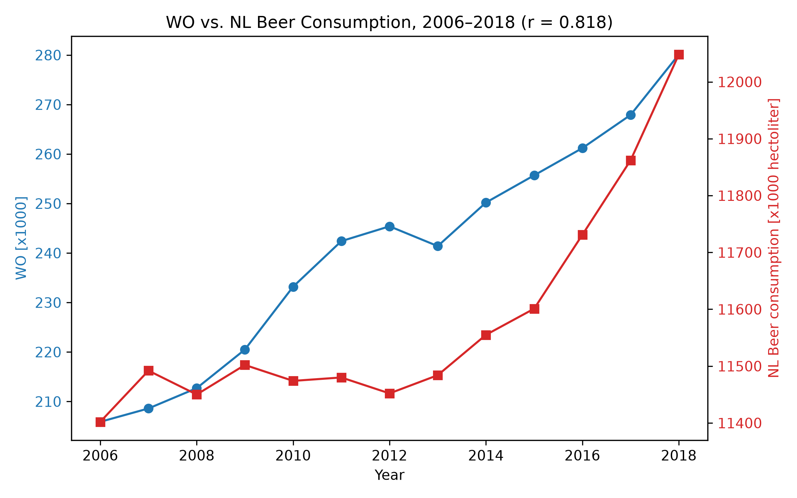

These papers are essential:

MCC Van Dyke et al., 2019 — "Fantastic yeasts and where to find them: the hidden diversity of dimorphic fungal pathogens"
JT Harvey, Applied Ergonomics, 2002 — "An analysis of the forces required to drag sheep over various surfaces"
DW Ziegler et al., 2005 — "The neurocognitive effects of alcohol on adolescents and college students"

This plot has been generated by the csv file. it shows a clear correlation between beer consumption and WO Masters studied!

